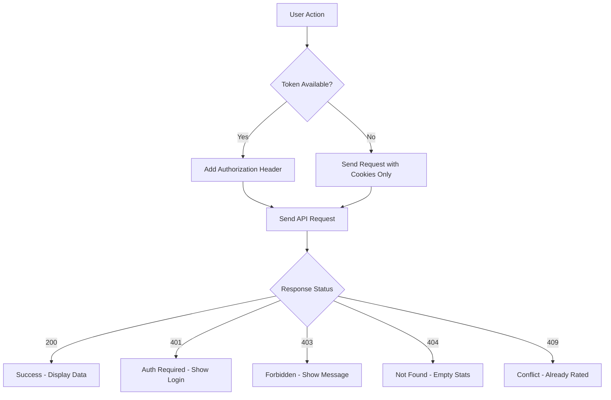

# Rating Service Integration Test Guide

## Overview
This guide provides steps to test the updated rating service with corrected backend endpoints and improved authentication handling.

## Updated Features

### 1. API Endpoints
- ✅ **Rating Stats**: `/api/v1/ratings/menu-item/:id/stats`
- ✅ **Submit Rating**: `/api/v1/ratings/order-item`
- ✅ **User Rating Check**: `/api/v1/ratings/menu-item/:id/user-rating`
- ✅ **Menu Item Ratings**: `/api/v1/ratings/menu-item/:id`

### 2. Authentication Improvements
- ✅ **JWT Token Headers**: Automatically adds `Authorization: Bearer ${token}` to requests
- ✅ **Token Detection**: Checks localStorage and cookies for auth tokens
- ✅ **Error Handling**: Graceful handling of 401, 403, 404, and 409 errors
- ✅ **Fallback Behavior**: Returns empty stats for 404 errors instead of throwing

### 3. Enhanced Error Messages
- **401 Unauthorized**: "Please log in to submit a rating"
- **403 Forbidden**: "You can only rate items from your verified orders"
- **404 Not Found**: Returns empty rating stats (no error thrown)
- **409 Conflict**: "You have already rated this item"

## Testing Steps

### 1. Browser Console Testing

Open the browser developer console and run:

```javascript
// Test the rating service
testRatingService('your-menu-item-id');

// Or test with a real menu item ID from your database
testRatingService('507f1f77bcf86cd799439011');
```

This will run comprehensive tests and display results in a table format.

### 2. Component Testing

#### Test Rating Display (MenuItemCard)
1. Navigate to the menu page
2. Observe rating stars and review counts on menu item cards
3. Check browser console for any authentication or API errors
4. Ratings should display even for unauthenticated users

#### Test Rating Submission (ItemDetailDrawer)
1. Click on a menu item to open the detail drawer
2. Scroll to the rating section
3. **For authenticated users**: Should see rating interface
4. **For unauthenticated users**: Should see "Please log in" message
5. **For users who haven't ordered**: Should see "Order this item first" message

### 3. Authentication Flow Testing

#### Test Unauthenticated Access
1. Log out (if logged in)
2. Navigate to menu
3. ✅ Rating stats should still display
4. ✅ No authentication errors in console
5. ✅ Rating submission should show login prompt

#### Test Authenticated Access
1. Log in to the application
2. Navigate to menu
3. ✅ Rating stats should display with full details
4. ✅ User can submit ratings for ordered items
5. ✅ Existing ratings should pre-populate form

### 4. Error Handling Testing

#### Test Network Errors
1. Open Network tab in DevTools
2. Block rating service requests
3. ✅ Components should show fallback content
4. ✅ No app crashes or white screens

#### Test Invalid Menu Item IDs
1. Use browser console: `testRatingService('invalid-id')`
2. ✅ Should handle gracefully without throwing errors
3. ✅ Should return empty stats for 404 responses

## Implementation Details

### Files Updated

1. **`/src/api/ratingService.ts`**
   - Enhanced error handling for auth and HTTP errors
   - Returns empty stats for 404 instead of throwing
   - Specific error messages for different HTTP status codes

2. **`/src/components/menu/MenuItemCard.tsx`**
   - Improved error handling in rating stats fetch
   - Graceful handling of authentication errors

3. **`/src/components/MenuItemRating.tsx`**
   - Enhanced error handling for auth failures
   - Better logging for debugging authentication issues

4. **`/src/api/apiClient.ts`**
   - Enhanced logging for token usage debugging
   - Better visibility into authentication state

5. **`/src/types/index.ts`**
   - Extended `CartItemModifier` interface with optional fields

6. **`/src/utils/testRatingService.ts`** (New)
   - Comprehensive testing utilities
   - Browser console testing functions

### Authentication Flow



### Error Recovery Strategy

1. **Rating Stats (Public Data)**
   - 404 → Return empty stats
   - 401 → Return empty stats (ratings should be public)
   - Network error → Return empty stats

2. **Rating Submission (Requires Auth)**
   - 401 → Show "Please log in" message
   - 403 → Show "Order required" message
   - 409 → Show "Already rated" message

3. **User Rating Check (Requires Auth)**
   - 401 → Return null (not an error)
   - 404 → Return null (no existing rating)

## Success Criteria

- ✅ Rating stats display correctly for all users
- ✅ Authentication required operations show appropriate messages
- ✅ No application crashes from rating service errors
- ✅ Proper JWT token handling in all requests
- ✅ Graceful degradation when backend is unavailable
- ✅ Clear error messages for different scenarios

## Troubleshooting

### Common Issues

1. **"Please log in" errors for public data**
   - Check if rating stats endpoint requires authentication
   - Verify backend returns 404 instead of 401 for missing data

2. **Token not being sent**
   - Check browser localStorage for `auth_token`
   - Verify apiClient logs show "Added token to request headers"

3. **CORS errors**
   - Verify `withCredentials: true` in apiClient
   - Check backend CORS configuration

### Debug Commands

```javascript
// Check current authentication state
console.log('Token:', localStorage.getItem('auth_token'));
console.log('User:', JSON.parse(localStorage.getItem('user') || 'null'));

// Test individual rating service methods
ratingService.getMenuItemRatingStats('menu-item-id').then(console.log);
ratingService.getUserRatingForItem('menu-item-id').then(console.log);
```

## Conclusion

The rating service has been successfully updated to work with the corrected backend endpoints and includes comprehensive error handling for authentication scenarios. The system gracefully handles both authenticated and unauthenticated users while providing clear feedback for different error conditions.